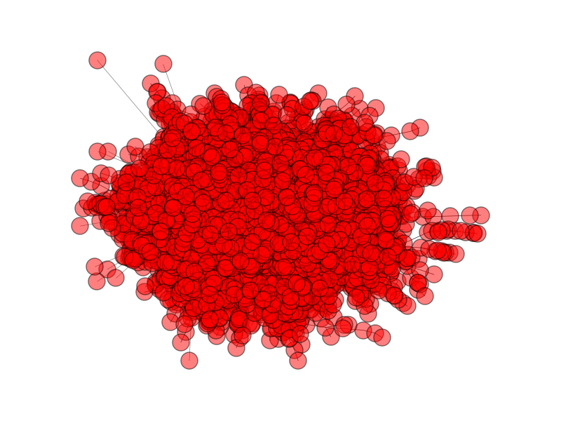
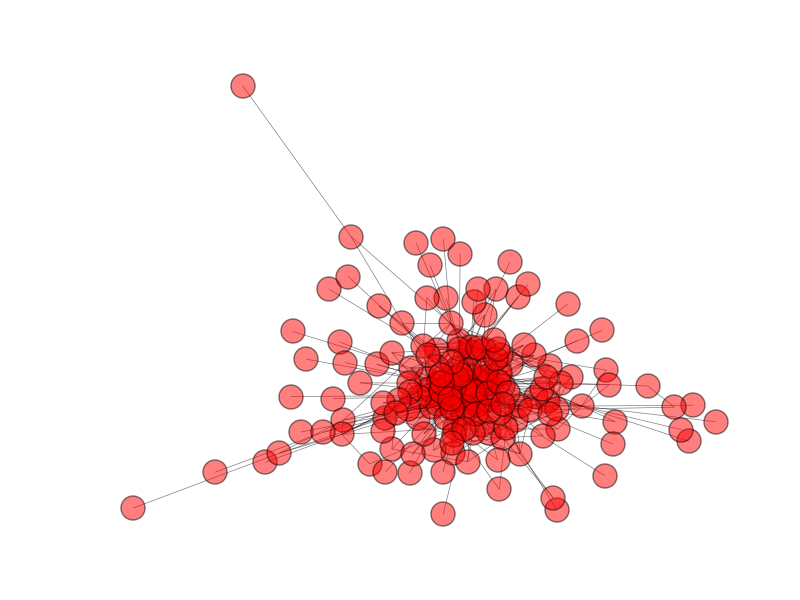

#Community Detection in social networks using modularity measure optimization
 - implemented as solution to one of problems of Fanavard Data Minig challanege 
 
One of the most important tasks when studying networks is that of identifying network communities. Fundamentally, communities allow us to discover groups of interacting objects (i.e., nodes) and the relations between them. For example,
in social networks, communities correspond to groups of friends who attended the same school, or who come from the same hometown [28]; in protein interaction networks, communities are functional modules of interacting proteins [1];
in co-authorship networks, communities correspond to scientific disciplines. Identifying network communities allows us to discover functionally related objects,
study interactions between modules, infer missing attribute values, and predict unobserved connections.

<figure>
  
  <figcaption>Fig1. - A view of Raw network Gragh.</figcaption>
</figure>
<figure>
  
  <figcaption>Fig2. - Induced graph of community structures.</figcaption>
</figure>

in this project we usd Louvain Method implementation from NetworkX library for community detection. Modularity is a scale value between -1 and 1 that measures the density of edges inside communities to edges outside communities. Optimizing this value theoretically results in the best possible grouping of the nodes of a given network.
This method is a greedy optimization method that appears to run in time O(n log n).

###references:
Fast unfolding of communities in large networks, Vincent D Blondel, Jean-Loup Guillaume, Renaud Lambiotte, Renaud Lefebvre, Journal of Statistical Mechanics: Theory and Experiment 2008(10), P10008 (12pp)
ArXiv: http://arxiv.org/abs/0803.0476
